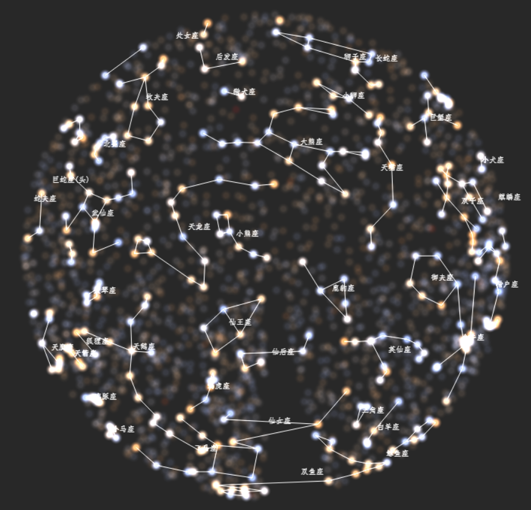

<div align="center">
  
</div>
<br />

Website: https://charlespikachu.github.io/constellation/


# Constellation
```
Constellation: Beautiful starry sky written by js.
You can star this repository to keep track of the project if it's helpful for you, thank you for your support.
```


# Projects in Charles_pikachu
- [Games](https://github.com/CharlesPikachu/Games): Create interesting games by pure python.
- [DecryptLogin](https://github.com/CharlesPikachu/DecryptLogin): APIs for loginning some websites by using requests.
- [Musicdl](https://github.com/CharlesPikachu/musicdl): A lightweight music downloader written by pure python.
- [Videodl](https://github.com/CharlesPikachu/videodl): A lightweight video downloader written by pure python.
- [Pytools](https://github.com/CharlesPikachu/pytools): Some useful tools written by pure python.
- [PikachuWeChat](https://github.com/CharlesPikachu/pikachuwechat): Play WeChat with itchat-uos.
- [Pydrawing](https://github.com/CharlesPikachu/pydrawing): Beautify your image or video.
- [ImageCompressor](https://github.com/CharlesPikachu/imagecompressor): Image compressors written by pure python.
- [FreeProxy](https://github.com/CharlesPikachu/freeproxy): Collecting free proxies from internet.
- [Paperdl](https://github.com/CharlesPikachu/paperdl): Search and download paper from specific websites.
- [Sciogovterminal](https://github.com/CharlesPikachu/sciogovterminal): Browse "The State Council Information Office of the People's Republic of China" in the terminal.
- [CodeFree](https://github.com/CharlesPikachu/codefree): Make no code a reality.
- [DeepLearningToys](https://github.com/CharlesPikachu/deeplearningtoys): Some deep learning toys implemented in pytorch.
- [DataAnalysis](https://github.com/CharlesPikachu/dataanalysis): Some data analysis projects in charles_pikachu.


# Reference
```
[1]. https://zhuanlan.zhihu.com/p/97186723
[2]. https://github.com/takasa5/michibiki
[3]. http://uenosato.net/hr_diagram/hrdiagram3.html
[4]. https://github.com/asSqr/Hipplanetarium
```


# More
#### WeChat Official Accounts
*Charles_pikachu*  
